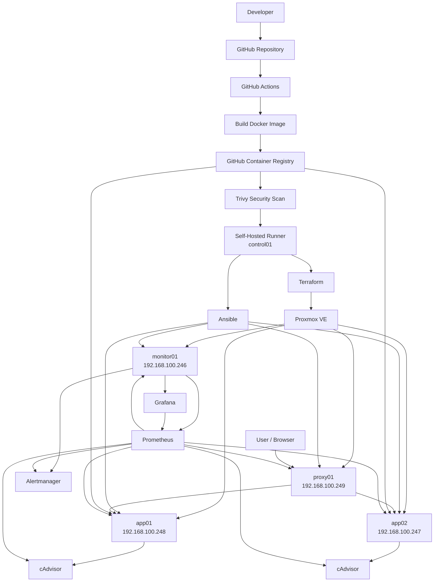
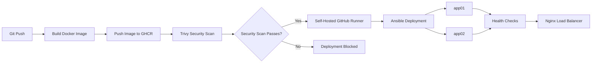
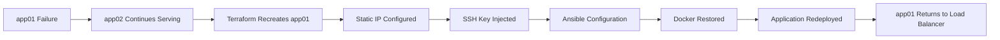

# DevOps Homelab Project

A production-style DevOps homelab running on Proxmox VE, designed to demonstrate practical experience with Infrastructure as Code, configuration management, container deployment, CI/CD, monitoring, security scanning, secrets management, high availability, backup, and disaster recovery.

This project was built as a hands-on environment to simulate real-world DevOps workflows using multiple Linux virtual machines.

---

## Architecture



---

## Infrastructure

| Host | Role | IP Address |
|---|---|---|
| control01 | Terraform, Ansible, GitHub Actions Self-Hosted Runner | Control Node |
| monitor01 | Prometheus, Grafana, Alertmanager, Node Exporter | 192.168.100.246 |
| app02 | Docker Application Node, Node Exporter, cAdvisor | 192.168.100.247 |
| app01 | Docker Application Node, Node Exporter, cAdvisor | 192.168.100.248 |
| proxy01 | Nginx Reverse Proxy / Load Balancer, Node Exporter | 192.168.100.249 |

Virtual machines are hosted on Proxmox VE and provisioned using Terraform.

---

## Technology Stack

### Infrastructure

- Proxmox VE
- Terraform
- Ubuntu Server
- Cloud-Init
- QEMU Guest Agent

### Configuration Management

- Ansible
- SSH key authentication
- Ansible Vault

### Containers

- Docker
- Docker Compose / Docker modules
- Nginx
- GitHub Container Registry

### Monitoring

- Prometheus
- Grafana
- Alertmanager
- Node Exporter
- cAdvisor

### CI/CD and Security

- GitHub Actions
- Self-hosted GitHub Actions Runner
- Trivy vulnerability scanning
- GitHub Secrets
- Immutable Git SHA Docker image tags

---

## Application

The project deploys a simple IT Service Status application across two Docker application servers.

Example services displayed by the application:

- Microsoft 365
- VPN
- Authentication
- ServiceNow

The application is deployed to:

```text
app01: 192.168.100.248:8080
app02: 192.168.100.247:8080
```

Users access the application through the Nginx reverse proxy:

```text
http://192.168.100.249
```

Nginx distributes requests between both application nodes.

---

## CI/CD Pipeline



The CI/CD pipeline performs the following steps:

1. Developer pushes application changes to GitHub.
2. GitHub Actions starts the workflow.
3. A Docker image is built.
4. The image is pushed to GitHub Container Registry.
5. Trivy scans the container image for vulnerabilities.
6. Deployment is blocked if configured HIGH or CRITICAL vulnerabilities are detected.
7. The self-hosted GitHub Actions runner on `control01` executes the deployment.
8. Ansible deploys the new image to `app01` and `app02`.
9. Health checks verify both application containers.
10. Nginx continues serving traffic through the load-balanced application nodes.

Docker images are tagged using the Git commit SHA to provide traceability and immutable deployments.

---

## Security Scanning

Trivy is integrated into the GitHub Actions pipeline.

The security gate is configured to scan Docker images for:

- HIGH vulnerabilities
- CRITICAL vulnerabilities

Example workflow:

```text
Build
  |
  v
Push to GHCR
  |
  v
Trivy Security Scan
  |
  +---- Vulnerabilities found ----> Deployment Blocked
  |
  +---- Scan Passed -------------> Deployment Continues
```

During testing, Trivy successfully detected vulnerable Alpine packages and blocked the deployment until the vulnerabilities were remediated.

---

## Secrets Management

Sensitive values are stored using Ansible Vault rather than plaintext configuration files.

Example:

```yaml
vault_grafana_admin_password: "encrypted-value"
```

Ansible playbooks reference the encrypted variable:

```yaml
GF_SECURITY_ADMIN_PASSWORD: "{{ vault_grafana_admin_password }}"
```

The encrypted Vault file can safely remain in the repository while the Vault password is handled separately.

GitHub Actions can access the Vault password through GitHub repository secrets.

---

## Monitoring

Prometheus collects infrastructure and container metrics from the homelab.

### Node Exporter

Node Exporter is deployed on:

- app01
- app02
- proxy01
- monitor01

Prometheus scrapes Node Exporter on port:

```text
9100
```

### cAdvisor

cAdvisor runs on the application nodes:

```text
app01: 192.168.100.248:8081
app02: 192.168.100.247:8081
```

This provides Docker container metrics including:

- CPU usage
- Memory usage
- Network traffic
- Container resource consumption

### Prometheus

Prometheus is available at:

```text
http://192.168.100.246:9090
```

### Grafana

Grafana is available at:

```text
http://192.168.100.246:3000
```

Grafana dashboards include infrastructure and container monitoring.

The Node Exporter Full dashboard is used for host-level visibility.

### Alertmanager

Alertmanager is available at:

```text
http://192.168.100.246:9093
```

---

## Alerting

Prometheus alert rules are configured for common infrastructure problems.

Current alerts include:

### Server Down

Triggers when a Node Exporter target becomes unavailable.

```text
up{job="node_exporter"} == 0
```

### High CPU Usage

Triggers when CPU usage remains above the configured threshold.

### High Memory Usage

Triggers when memory usage remains above the configured threshold.

Alerting was tested by intentionally stopping Node Exporter on an application server.

Prometheus detected the failure and successfully sent the alert to Alertmanager.

---

## High Availability

The application runs on two independent Docker nodes:

```text
            Nginx
              |
       -----------------
       |               |
     app01           app02
     :8080           :8080
```

If one application node becomes unavailable, the second application node can continue serving traffic.

This behavior was tested during the disaster recovery exercise.

---

## Disaster Recovery Test

The environment was tested by intentionally destroying `app01`.

The recovery workflow was:

1. `app01` was intentionally destroyed using Terraform.
2. `app02` continued serving the application.
3. Terraform recreated `app01`.
4. The VM was automatically assigned its static IP:

```text
192.168.100.248
```

5. The Ansible SSH public key was automatically injected.
6. Ansible reconfigured the rebuilt server.
7. Docker was installed and configured.
8. The application container was redeployed.
9. Health checks confirmed the application was operational.
10. `app01` successfully returned to the load-balanced service.



This exercise demonstrated both high availability and infrastructure recovery.

---

## Infrastructure Recovery Improvements

The initial disaster recovery test identified two issues:

- DHCP assigned a different IP after VM recreation.
- The Ansible SSH key was not automatically available.

The Terraform configuration was improved to provide:

- Static IP addresses
- Cloud-Init networking
- Automatic SSH public key injection

Example Terraform configuration:

```hcl
initialization {
  datastore_id = "local-lvm"

  ip_config {
    ipv4 {
      address = "192.168.100.248/24"
      gateway = "192.168.100.1"
    }
  }

  user_account {
    username = "devops"

    keys = [
      trimspace(file("/home/devops/.ssh/ansible_ed25519.pub"))
    ]
  }
}
```

This makes future VM recovery significantly more predictable.

---

## Backup and Restore

Ansible playbooks are included for backup and recovery operations.

Available playbooks include:

```text
backup.yml
restore.yml
```

The backup workflow includes application and monitoring configuration.

The restore workflow can be used to recover configuration after infrastructure recreation.

---

## Ansible Automation

Ansible is used to manage configuration and deployment across the environment.

Main playbooks include:

```text
site.yml
docker.yml
app.yml
deploy-app.yml
proxy.yml
monitoring.yml
prometheus.yml
grafana.yml
alertmanager.yml
alert-rules.yml
cadvisor.yml
backup.yml
restore.yml
```

Ansible inventory groups include:

```ini
[app]
app01
app02

[monitoring]
monitor01

[proxy]
proxy01
```

---

## Terraform Automation

Terraform manages the Proxmox virtual machines.

The environment uses a reusable Ubuntu Server template and creates the required virtual machines through the Proxmox Terraform provider.

Terraform manages:

- VM cloning
- CPU
- Memory
- Network adapter
- Static IP configuration
- Cloud-Init
- SSH key injection
- QEMU Guest Agent

Example workflow:

```text
Terraform
   |
   v
Proxmox API
   |
   +--- app01
   +--- app02
   +--- monitor01
   +--- proxy01
```

---

## Project Structure

```text
devops-platform/
|
├── .github/
│   └── workflows/
│       └── build.yml
|
├── ansible/
│   ├── inventory/
│   │   └── hosts.ini
│   ├── group_vars/
│   ├── site.yml
│   ├── docker.yml
│   ├── deploy-app.yml
│   ├── proxy.yml
│   ├── monitoring.yml
│   ├── prometheus.yml
│   ├── grafana.yml
│   ├── alertmanager.yml
│   ├── alert-rules.yml
│   ├── cadvisor.yml
│   ├── backup.yml
│   └── restore.yml
|
├── application/
│   ├── Dockerfile
│   └── index.html
|
├── terraform/
│   ├── main.tf
│   ├── variables.tf
│   ├── provider.tf
│   └── terraform.tfvars
|
└── README.md
```

Terraform state files, secrets, private keys, and other sensitive files are excluded using `.gitignore`.

---

## Verification

The following endpoints are used to verify the environment:

### Application Nodes

```bash
curl http://192.168.100.248:8080
curl http://192.168.100.247:8080
```

### Nginx Load Balancer

```bash
curl http://192.168.100.249
```

### Prometheus

```bash
curl http://192.168.100.246:9090/-/healthy
```

### Alertmanager

```bash
curl http://192.168.100.246:9093/-/healthy
```

### Grafana

```bash
curl -I http://192.168.100.246:3000
```

### Ansible Connectivity

```bash
ansible all \
  -i ansible/inventory/hosts.ini \
  -m ping \
  --ask-vault-pass
```

---

## Key DevOps Concepts Demonstrated

This project demonstrates practical experience with:

- Infrastructure as Code
- Configuration Management
- Linux Administration
- Virtualization
- Containerization
- Docker Image Management
- Reverse Proxying
- Load Balancing
- CI/CD
- Self-Hosted CI/CD Runners
- Container Security Scanning
- Secrets Management
- Infrastructure Monitoring
- Container Monitoring
- Alerting
- High Availability
- Backup and Restore
- Disaster Recovery
- Git-Based Change Management

---

## Future Improvements

Potential future enhancements include:

- Automated Proxmox VM backups
- Centralized logging with Loki
- Grafana Loki integration
- Application-level Prometheus metrics
- Blackbox Exporter
- Automated SSL/TLS certificates
- Cloudflare Tunnel integration
- Automated Ansible linting
- Terraform validation in CI
- Branch protection and pull request workflows
- Least-privilege Terraform Proxmox role
- Database integration
- Automated database backup and restore
- Kubernetes or K3s migration as a future version

---

## Project Objective

The purpose of this project is to build a realistic DevOps environment that demonstrates how infrastructure can be provisioned, configured, deployed, monitored, secured, and recovered using automation.

Rather than focusing on a single DevOps tool, the project demonstrates how multiple technologies work together as part of an end-to-end platform.

The project is designed to provide practical hands-on experience and serve as a technical portfolio project for DevOps and infrastructure engineering roles.

## Lessons Learned

During development and disaster-recovery testing, several real-world issues were encountered and resolved:

- DHCP caused rebuilt virtual machines to receive different IP addresses.
  - Resolved by implementing static IP configuration through Terraform and Cloud-Init.

- Recreated virtual machines generated new SSH host keys.
  - Old entries in `known_hosts` had to be removed before reconnecting.

- Rebuilt application nodes initially lacked the Ansible SSH key.
  - Terraform was updated to automatically inject the Ansible public key.

- Prometheus failed after infrastructure recreation because `alerts.yml` was accidentally created as a directory by a Docker bind mount.
  - The alert rules deployment order was corrected and the Prometheus container was recreated.

- Trivy detected HIGH vulnerabilities in the application container.
  - The vulnerable Alpine packages were upgraded before allowing deployment to continue.

- Monitoring services needed to be redeployed after VM recreation.
  - Ansible playbooks were used to restore Prometheus, Grafana, Alertmanager, Node Exporter, and application services.

These issues helped improve the automation and made the environment more reproducible and resilient.