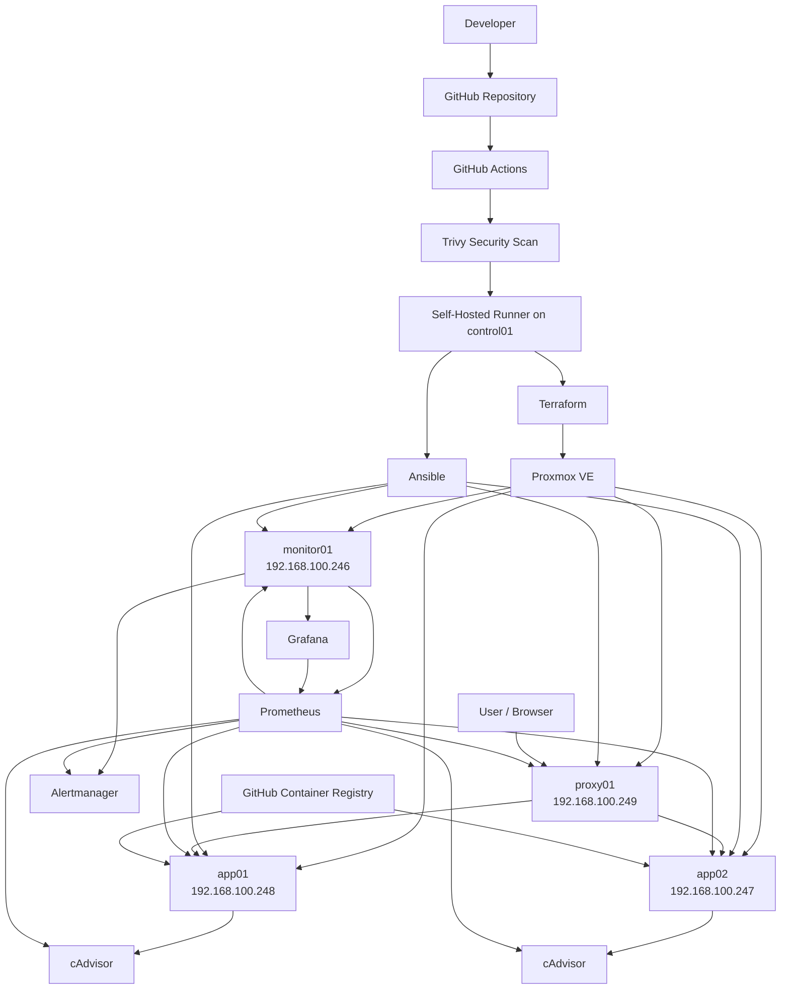

# DevOps Homelab Project

A production-style DevOps homelab running on Proxmox, designed to demonstrate Infrastructure as Code, configuration management, container deployment, monitoring, CI/CD, security scanning, secrets management, and disaster recovery.

## Architecture

## Infrastructure

| Host | Role | IP |
|---|---|---|
| control01 | Terraform, Ansible, GitHub Runner | Control Node |
| monitor01 | Prometheus, Grafana, Alertmanager | 192.168.100.246 |
| app02 | Docker Application Node | 192.168.100.247 |
| app01 | Docker Application Node | 192.168.100.248 |
| proxy01 | Nginx Reverse Proxy / Load Balancer | 192.168.100.249 |

## CI/CD Flow

1. Developer pushes code to GitHub
2. GitHub Actions builds Docker image
3. Image is pushed to GHCR
4. Trivy scans the image
5. Deployment only continues if the security scan passes
6. Self-hosted GitHub runner executes Ansible
7. Application is deployed to app01 and app02
8. Health checks verify the application
9. Nginx serves traffic through the load balancer

## Monitoring

Prometheus collects metrics from:

- Node Exporter
- cAdvisor
- Application nodes
- Proxy node
- Monitoring node

Grafana provides dashboards for infrastructure and container monitoring.

Alertmanager receives alerts from Prometheus.

Examples:

- Server Down
- High CPU Usage
- High Memory Usage

## Security

- Trivy container vulnerability scanning
- Ansible Vault for encrypted secrets
- SSH key authentication
- GitHub repository secrets
- Immutable Docker image tags

## Disaster Recovery

The environment was tested by intentionally destroying an application VM.

Recovery process:

1. Destroy app01
2. app02 continues serving traffic
3. Terraform recreates app01
4. Static IP is automatically configured
5. SSH key is injected automatically
6. Ansible restores configuration
7. Docker application is redeployed
8. app01 rejoins the load-balanced service

## Backup and Restore

Ansible playbooks are included for:

- Backup
- Restore
- Monitoring configuration
- Application configuration

## Project Goals

This project demonstrates hands-on experience with:

- Infrastructure as Code
- Configuration Management
- Containers
- CI/CD
- Monitoring
- Security
- High Availability
- Disaster Recovery